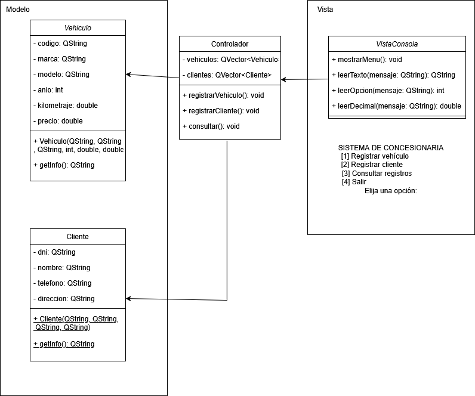

<h1>Práctica N°5 - Sistema de Gestión de Concesionaria</h1>

<h2>Universidad Politécnica Salesiana</h2>

<strong>Carrera:</strong> Ingeniería en Computación 
<strong>Nivel:</strong> Segundo semestre 
<strong>Asignatura:</strong> Programación Orientada a Objetos 
<strong>Estudiante:</strong> Angelo Córdova 
<strong>Grupo:</strong> 3

<h2>Resultado de Aprendizaje</h2>

Construir programas utilizando el paradigma de programación orientada a objetos.

<h2>Indicador de Logro</h2>

Abstrae objetos del mundo real y los modela mediante diagramas de clase.

<h2>Tiempo Estimado</h2>

2 - 3 horas

<h2>Descripción de la Práctica</h2>

Analizar las clases creadas e identificar atributos y métodos. Construir el diagrama de clases respectivo.

<h2>Clases Implementadas</h2>

<h3>Clase: Cliente</h3>
<pre>
- dni: QString
- nombre: QString
- telefono: QString
- direccion: QString
+ Cliente(QString d, QString n, QString t, QString dir)
+ getInfo(): QString
</pre>

<h3>Clase: Vehiculo</h3>
<pre>
- codigo: QString
- marca: QString
- modelo: QString
- anio: int
- kilometraje: double
- precio: double
+ Vehiculo(QString c, QString m, QString mo, int a, double km, double p)
+ getInfo(): QString
</pre>

<h3>Clase: Controlador</h3>
<pre>
- QVector&lt;Vehiculo&gt; vehiculos
- QVector&lt;Cliente&gt; clientes
+ registrarVehiculo(): void
+ registrarCliente(): void
+ consultar(): void
</pre>

<h3>Clase: VistaConsola</h3>
<pre>
+ mostrarMenu(): void
+ leerTexto(QString mensaje): QString
+ leerOpcion(QString mensaje): int
+ leerDecimal(QString mensaje): double
</pre>

<h2>Aplicación Principal</h2>
<pre>
int main() {
    VistaConsola::mostrarMenu();
    int opcion = VistaConsola::leerOpcion("Seleccione una opción: ");
    switch (opcion) {
        case 1: ctrl.registrarVehiculo(); break;
        case 2: ctrl.registrarCliente(); break;
        case 3: ctrl.consultar(); break;
        case 4: qInfo("Saliendo del sistema..."); break;
        default: qInfo("Opción no válida.");
    }
}
</pre>

<h2>Diagrama de Clases</h2>

<h2>Dificultades Encontradas</h2>

La principal dificultad fue al momento de realizar el enlace entre Git y GitHub usando la terminal. Sin embargo, con seguimiento paso a paso, el proyecto fue correctamente subido y documentado.

